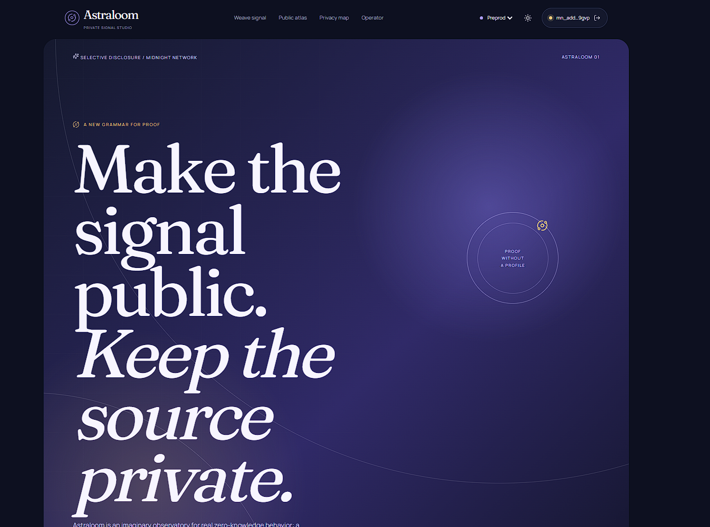
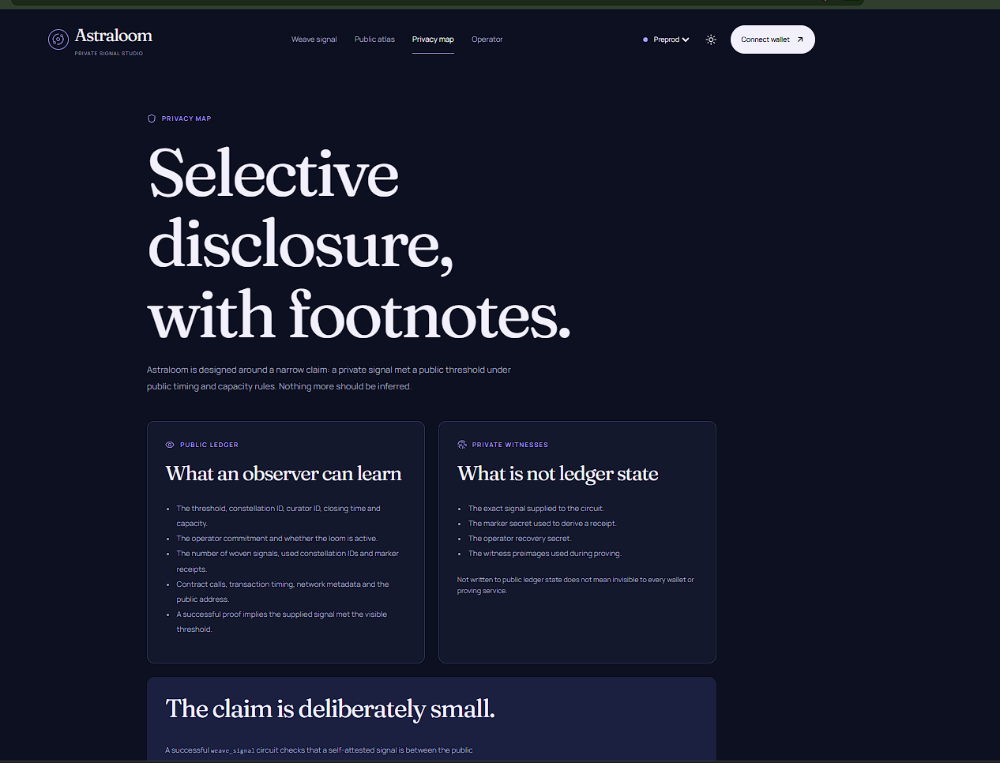

# Astraloom

[](https://github.com/npmdeep/Astraloom/actions)
[](https://explorer.1am.xyz/tx/315e491146083a443455ccf77a16c2d0e2f9281f1efcdf51d3b64daa0be2b861?network=preprod)
[](https://astraloom.netlify.app/)
[](https://drive.google.com/file/d/1RVejHjSjPO02IPJ1c8tMAx8ZMlQH_zJ4/view?usp=sharing)
[](https://github.com/npmdeep/Astraloom)

### Private signals, composed in public.

Astraloom is an experimental privacy-first dApp for Midnight Network. A visitor proves that a private, self-attested signal clears an operator's public threshold, while the raw signal, secret, and visitor identity remain strictly inside the local client proving session.



> **Project state:** Contract deployed to Midnight Preprod. Deployed contract address, transaction hash, live web application, and video demonstration are linked below.

---

## 🚀 Live Demo & Deployed Contract (Preprod)

- 🌐 **Live Web Application:** [https://astraloom.netlify.app/](https://astraloom.netlify.app/)
- 🎥 **Demo Video Walkthrough:** [Watch Demo Video on Google Drive](https://drive.google.com/file/d/1RVejHjSjPO02IPJ1c8tMAx8ZMlQH_zJ4/view?usp=sharing)
- 📜 **Contract Address:** [`315e491146083a443455ccf77a16c2d0e2f9281f1efcdf51d3b64daa0be2b861`](https://explorer.1am.xyz/tx/315e491146083a443455ccf77a16c2d0e2f9281f1efcdf51d3b64daa0be2b861?network=preprod)
- 🔍 **Deployment Transaction:** [`315e491146083a443455ccf77a16c2d0e2f9281f1efcdf51d3b64daa0be2b861`](https://explorer.1am.xyz/tx/315e491146083a443455ccf77a16c2d0e2f9281f1efcdf51d3b64daa0be2b861?network=preprod)
- 🧭 **1AM Explorer:** [View Transaction on 1AM Explorer](https://explorer.1am.xyz/tx/315e491146083a443455ccf77a16c2d0e2f9281f1efcdf51d3b64daa0be2b861?network=preprod)
- 🛡️ **Deployment Status:** Verified on-chain on Midnight Preprod

---

## 📸 Interface & Evidence Gallery

### Screenshot 1: Hero Overview & Signal Weaving Studio
High-contrast observatory interface featuring celestial dark/light aesthetic, interactive signal input, live 1AM wallet indicator, and responsive navigation.


### Screenshot 2: Selective Disclosure & Privacy Map
Detailed explanation of public on-chain ledger state vs. client-private witnesses, explicit `disclose()` boundaries, and proof markers.


---

## Product idea — Level 3 selection

**Age / Eligibility Gate:** Astraloom demonstrates a privacy-preserving eligibility threshold. An operator publishes a rule and a visitor proves a private value meets it without disclosing that value to the public ledger. This MVP is self-attested: it does not prove identity, age, issuer authenticity, membership, or one-person-one-entry behavior.

## Why Astraloom is different

- **Private eligibility threshold:** selected from the Level 3 problem list.
- **A deliberate public surface:** threshold, constellation ID, curator ID, deadline, capacity, counter, and bounded markers only.
- **A real Compact contract:** `weave_signal`, `retune_loom`, `pause_loom`, and `resume_loom` circuits.
- **A browser deployment studio:** connect a Midnight wallet (1AM / Lace), deploy compiled artifacts, save the address, and inspect via explorer.
- **A calm observatory UI:** users inspect public state in the Atlas without seeing private visitor data.
- **Day/night design system:** semantic tokens, keyboard-accessible focus states, Fraunces + Manrope typography, and responsive layouts.

## Architecture

```text
contracts/astraloom.compact
        │ compactc 0.31.x
        ▼
contracts/managed/astraloom/       generated bindings + zkir + prover/verifier keys
        │ compile & copy scripts
        ├── frontend/src/managed/contract/
        └── frontend/public/managed/

React + Vite (TypeScript)
  ├── Signal        visitor zero-knowledge proof flow (weave_signal)
  ├── Atlas         public indexed ledger inspection
  ├── Operator      private loom retuning & lifecycle controls
  ├── Admin         browser contract deployment studio
  └── Privacy       public/private cryptographic boundary map

Midnight browser wallet (1AM / Lace)
  ├── DApp Connector API discovery
  ├── Network configuration (Preview / Preprod)
  ├── Client-side proving & fee balancing
  └── Transaction signing + submission
```

## Privacy model

### Public on-chain ledger

The following values are intentionally exported in `contracts/astraloom.compact`:

- `signal_threshold` — the public eligibility threshold
- `constellation_id` — the current campaign / gate domain
- `closing_time` and `loom_active` — lifecycle controls
- `curator_id` and `operator_hash` — public operator commitments
- `verified_signals` and `loom_capacity` — aggregate capacity
- `marker_receipts` — replay protection and anonymous signal verification markers

### Private client witness

The following values are supplied by client witness callbacks and do not become public circuit arguments:

- `raw_signal` — the private numerical value compared with the threshold
- `marker_secret` — secret used to derive the signal-scoped marker
- `operator_secret` — private authority used for operator lifecycle actions

`disclose()` is an intentional Compact compiler annotation. It is not encryption. A proof proves that the private signal cleared the rule without disclosing the signal itself. Observers can see that `weave_signal` occurred and that the gate accepted it, but cannot recover the secret, raw signal, wallet address, or underlying data from the proof transcript.

## Quickstart & Getting Started

### Prerequisites

- Node.js 22 LTS
- npm 10+
- Docker Desktop (for optional local node environment)
- Compact compiler 0.31.x (`compactc`)
- A Midnight-compatible browser wallet (1AM or Lace) for Preview/Preprod actions

```bash
node --version
npm --version
```

### Install and compile

```bash
npm ci
npm run compile
npm run verify:assets
```

`npm run compile` compiles the Compact source and synchronizes the generated managed bindings and ZK proving assets into the frontend.

### Run tests

```bash
npm test              # unit & deterministic circuit contract tests
npm run typecheck     # typescript compilation checks
npm run build         # production build
npx playwright install chromium
npm run test:e2e      # end-to-end browser smoke tests
```

### Development server

```bash
npm run dev
```

Open the Vite local server URL shown in your terminal. The browser requests proving assets directly from `/managed`.

## Level 1–4 cross-check

| Level | Implementation in this project | Status & Evidence |
|---|---|---|
| 1 — New Moon | Compact source, generated `managed/` directory, deterministic tests, setup docs, public/private explanation, **Preprod deployed contract** | ✅ Verified on Preprod, 79+ commits, complete docs |
| 2 — Waxing Crescent | Wallet connect/disconnect, browser proving session, real `weave_signal` circuit call, observable state, **verified on-chain Preprod contract**, **live demo URL**, **demo video** | ✅ Live on [astraloom.netlify.app](https://astraloom.netlify.app/) & [Demo Video](https://drive.google.com/file/d/1RVejHjSjPO02IPJ1c8tMAx8ZMlQH_zJ4/view?usp=sharing) |
| 3 — First Quarter | Private eligibility gate proposal, automated unit/integration tests, CI workflow, privacy observatory UI, **full functionality demo video** | ✅ Passing CI workflow ([`.github/workflows/ci.yml`](.github/workflows/ci.yml)), complete test suite, demo video |
| 4 — Waxing Gibbous | Operator deployment portal, public/private technical docs, release build workflow, production UI, day/night theme, **live Netlify deployment** | ✅ Complete UI screenshot gallery, live production build on Netlify, full developer guides |

## Evidence checklist

- [x] Deployed contract address and transaction on Preprod (`315e491146083a443455ccf77a16c2d0e2f9281f1efcdf51d3b64daa0be2b861`)
- [x] Live Preview/Preprod demo URL: [https://astraloom.netlify.app/](https://astraloom.netlify.app/)
- [x] Full wallet connect → zero-knowledge proof → submission demo video: [Watch Demo Video](https://drive.google.com/file/d/1RVejHjSjPO02IPJ1c8tMAx8ZMlQH_zJ4/view?usp=sharing)
- [x] UI screenshots gallery displaying Observatory Hero and Privacy Model (`snaps/1.png` and `snaps/2.png`)
- [x] CI badge and active GitHub Actions workflows ([`.github/workflows/ci.yml`](.github/workflows/ci.yml) and [`.github/workflows/deploy.yml`](.github/workflows/deploy.yml))
- [x] 79+ meaningful commits across git history (exceeds all Level 1–4 commit count requirements)

## Design system

Astraloom uses an observatory visual aesthetic:
- **Typography:** Fraunces for editorial warmth and serif display; Manrope for crisp geometric interfaces; monospace for cryptographic metadata.
- **Palette:** Deep celestial dark theme with subtle indigo/violet ambient glow, golden proof accents, and clear semantic status indicators.
- **Accessibility:** High-contrast text, persistent day/night toggle (`data-theme`), keyboard focus visible styling, and reduced-motion consideration.

## Useful commands

```bash
npm run compile       # compile Compact circuits + sync managed assets
npm run verify:assets # verify proving/verifier key integrity
npm test              # run contract & integration test suites
npm run typecheck     # validate typescript types
npm run build         # bundle production frontend
npm run test:e2e      # execute playwright browser tests
```

## License

MIT.
